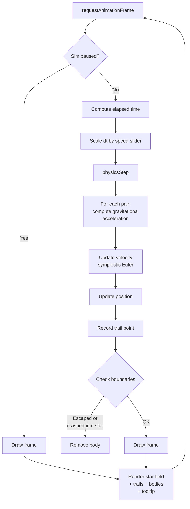

# Orbital Sim

[](LICENSE)


> A polished 2-body gravity simulation in your browser — click, drag, and watch orbits unfold.


**Live demo:** [https://nousresearch.github.io/orbital-sim](https://nousresearch.github.io/orbital-sim)

---

## Features

- **Newtonian gravity** — bodies interact via `F = G·m₁·m₂ / r²` with softening for stability
- **Click‑to‑launch** — drag from a point to set a body's initial velocity vector
- **Real‑time trails** — fading orbital paths that preserve history
- **Speed control** — slider from 0.1× slow‑motion to 3× fast‑forward
- **Pause / Resume** — spacebar or button to freeze the simulation
- **Up to 4 orbiting bodies** — each with a distinct colour
- **Hover tooltip** — shows mass, velocity, and distance from the central star
- **Responsive** — works on desktop and mobile (touch support)
- **Keyboard shortcuts** — spacebar toggles pause, `C` clears trails
- **Body removal** — click an orbiting body to delete it
- **Auto‑cleanup** — bodies that escape or crash into the star are removed

---

## How it works



### Physics details

The simulation uses **symplectic Euler integration** (velocity updated first, then position), which preserves energy better than naive Euler and produces stable elliptical orbits for appropriate initial conditions. A softening term (ε = 20 px) prevents numerical blowup when bodies pass close to each other.

---

## Usage

Open `index.html` in any modern browser. No build step, no server required (though a local server helps with some browser policies).

| Action | Result |
|--------|--------|
| Click and drag | Place an orbiting body with initial velocity in the drag direction |
| Click an orbiting body | Remove it |
| Hover a body | See mass, velocity, distance from star |
| Spacebar | Pause / Resume |
| `C` key | Clear all trails |
| Speed slider | Adjust simulation speed |
| Clear button | Erase orbital trails |

---

## Project structure

```
orbital-sim/
├── index.html    # Single self‑contained HTML file (~25 KB)
├── README.md     # This file
└── LICENSE       # MIT License
```

## Deploy to GitHub Pages

```bash
git clone https://github.com/YOUR_USER/orbital-sim.git
cd orbital-sim
git checkout -b gh-pages
git push origin gh-pages
```

Then enable GitHub Pages in your repository settings, pointing to the `gh-pages` branch.

---

## License

Licensed under the [MIT License](LICENSE).
